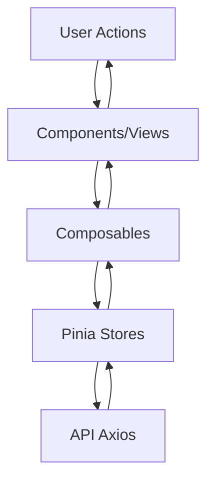
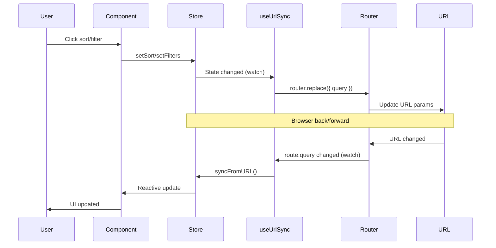

# Архітектура проекту

## Загальний огляд

Project Manager - це SPA (Single Page Application), побудована на Vue.js 3 з використанням Composition API. Проект слідує принципам компонентної архітектури та використовує Pinia для управління станом.

## Архітектурні принципи

### 1. Компонентна архітектура

Проект організований за принципом компонентної архітектури:

- **Views** - сторінки додатку (ProjectsView, ProjectDetailsView)
- **Components** - переиспользувані UI компоненти
- **Composables** - переиспользувана бізнес-логіка
- **Stores** - централізоване управління станом

### 2. DRY (Don't Repeat Yourself)

Для уникнення дублювання коду використовуються:

- **Composables** - для переиспользуваної логіки
- **Helpers** - для утилітарних функцій
- **Глобальні стилі** - для спільних стилів компонентів

### 3. Типізація

Повна типізація TypeScript забезпечує:

- Безпеку типів на етапі компіляції
- Автодоповнення в IDE
- Документацію через типи

## Потік даних



### Опис потоку

1. **Користувач** виконує дію (клік, введення даних)
2. **Компонент** обробляє подію та викликає composable або store action
3. **Composable/Store** виконує бізнес-логіку та оновлює стан
4. **API** виконує HTTP запит (якщо потрібно)
5. **Store** оновлює стан на основі відповіді API
6. **Компонент** реактивно оновлюється через Vue reactivity

## Управління станом (Pinia)

### Структура stores

#### 1. Projects Store (`store/projects.ts`)

**State:**

- `projects: Project[]` - список проектів
- `filters: ProjectsFilters` - фільтри (назва, статус)
- `sortField: SortField | null` - поле сортування
- `sortDirection: SortDirection` - напрямок сортування
- `taskCounts: Record<string, number>` - кількість завдань по проектах

**Getters:**

- `getProjectById` - отримати проект за ID
- `getTaskCount` - отримати кількість завдань проекту
- `filteredProjects` - відфільтровані та відсортовані проекти

**Actions:**

- `fetchAll()` - завантажити всі проекти
- `addProject()` - додати проект
- `updateProject()` - оновити проект
- `deleteProject()` - видалити проект
- `setFilters()` - встановити фільтри
- `setSort()` - встановити сортування

#### 2. Tasks Store (`store/tasks.ts`)

**State:**

- `tasks: Task[]` - список завдань
- `currentProjectId: string | null` - поточний проект
- `filters: TasksFilters` - фільтри (виконавець, статус)
- `sortField: SortField | null` - поле сортування
- `sortDirection: SortDirection` - напрямок сортування

**Getters:**

- `filteredTasks` - відфільтровані завдання
- `sortedTasks` - відфільтровані та відсортовані завдання
- `tasksByStatus` - завдання згруповані по статусах (для канбану)

**Actions:**

- `fetchByProjectId()` - завантажити завдання проекту
- `createTask()` - створити завдання
- `updateTask()` - оновити завдання
- `deleteTask()` - видалити завдання
- `reorderTasks()` - змінити порядок завдань
- `setCurrentProjectId()` - встановити поточний проект
- `setFilters()` - встановити фільтри
- `setSort()` - встановити сортування

#### 3. UI Store (`store/ui.ts`)

**State:**

- `viewMode: ViewMode` - режим перегляду ('table' | 'kanban')
- `projectsTableSettings` - налаштування таблиці проектів
- `tasksTableSettings` - налаштування таблиці завдань

**Actions:**

- `setViewMode()` - встановити режим перегляду
- `toggleViewMode()` - перемкнути режим перегляду
- `updateProjectsTableSettings()` - оновити налаштування таблиці проектів
- `updateTasksTableSettings()` - оновити налаштування таблиці завдань

### Персистентність

Всі stores використовують `pinia-plugin-persistedstate` для автоматичного збереження стану в localStorage:

```typescript
{
  persist: true
}
```

Це забезпечує:

- Збереження стану між перезавантаженнями
- Відновлення налаштувань користувача
- Збереження даних проекту та завдань

## Роутинг

### Маршрути

```mermaid
graph LR
    Root[/] --> ProjectsView[ProjectsView]
    Root --> ProjectDetails[/project/:id]
    ProjectDetails --> ProjectDetailsView[ProjectDetailsView]

    ProjectsView --> ProjectsTable[ProjectsTable]
    ProjectDetailsView --> TasksTable[TasksTable]
    ProjectDetailsView --> KanbanBoard[KanbanBoard]
```

### Маршрути

```typescript
/                          → ProjectsView (список проектів)
/project/:id               → ProjectDetailsView (деталі проекту)
```

### Навігація

- Використовується `vue-router` з history mode
- Навігація через `router.push()` та `router.replace()`
- Параметри маршруту доступні через `useRoute()`

## Composition API

### Використання

Всі компоненти використовують Composition API з `<script setup>`:

```vue
<script setup lang="ts">
import { ref, computed } from 'vue'
import { useStore } from '@/store'

const store = useStore()
const data = computed(() => store.data)
</script>
```

### Переваги

- Краща організація коду
- Легше переиспользование логіки через composables
- Краща типізація TypeScript
- Менше boilerplate коду

## Composables

### Призначення

Composables - це функції, які інкапсулюють переиспользувану логіку:

1. **useUrlSync** - синхронізація стану з URL параметрами
2. **useFormHandler** - обробка відправки форм
3. **useFormValidation** - валідація форм з Zod
4. **useColumnResize** - зміна ширини колонок таблиць

### Структура composable

```typescript
export function useComposable(options: Options) {
  // Reactive state
  const state = ref(initialValue)

  // Computed properties
  const computed = computed(() => ...)

  // Methods
  const method = () => { ... }

  // Return public API
  return {
    state,
    computed,
    method
  }
}
```

## Синхронізація з URL

### Принцип роботи

`useUrlSync` composable забезпечує двосторонню синхронізацію:

- **Store → URL**: зміни в store оновлюють URL параметри
- **URL → Store**: зміни в URL оновлюють store

### Діаграма синхронізації



### Використання

```typescript
useUrlSync({
  store: projectsStore,
  sortFieldArray: PROJECT_SORT_FIELDS_ARRAY,
  defaultSortField: null,
  urlPrefix: '', // для проектів
  onSyncFromUrl: () => {
    // Синхронізація фільтрів з URL
  },
})
```

### URL формат

**Проекти:**

```
/?sort=name&order=asc&status=active&name=test
```

**Завдання:**

```
/project/123?taskSort=status&taskOrder=desc&taskStatus=todo&taskAssignee=John
```

## Обробка помилок

### API помилки

Axios interceptors обробляють помилки:

- 401 - Unauthorized
- 403 - Forbidden
- 404 - Not Found
- 500 - Server Error
- Network errors

### Валідація форм

Zod схеми валідації:

- Автоматична перевірка типів
- Кастомні повідомлення про помилки
- Інтеграція з Vee-Validate

### Toast сповіщення

Використовується `vue-toast-notification` для:

- Успішних операцій
- Помилок
- Попереджень

## Стилізація

### SCSS структура

```
styles/
├── variables.scss    # Змінні (кольори, розміри, шрифти)
├── mixins.scss      # Mixins (переиспользувані стилі)
├── components.scss  # Глобальні стилі компонентів
└── main.scss        # Головні стилі
```

### Модульна система SCSS

Використовується `@use` замість `@import`:

- Краща інкапсуляція
- Уникнення конфліктів імен
- Оптимізація бандлу

### Змінні

Всі стилі використовують змінні з `variables.scss`:

- Кольори
- Розміри
- Шрифти
- Тіні
- Радіуси

## Оптимізація

### Code splitting

Vite автоматично розбиває код на chunks:

- Кожен route - окремий chunk
- Динамічні імпорти для lazy loading

### Tree shaking

Невикористаний код автоматично видаляється:

- TypeScript types
- Unused imports
- Dead code

### Персистентність

- Збереження стану в localStorage
- Відновлення стану при завантаженні
- Оптимізація запитів до API

## Безпека

### Валідація даних

- Валідація на клієнті (Zod)
- Валідація на сервері (майбутнє)
- Sanitization вхідних даних

### TypeScript

- Строга типізація
- Перевірка типів на етапі компіляції
- Уникнення runtime помилок

## Масштабованість

### Розширення функціоналу

Архітектура дозволяє легко додавати:

- Нові views
- Нові компоненти
- Нові stores
- Нові composables

### Модульність

Кожен модуль незалежний:

- Можна легко видаляти
- Можна легко замінювати
- Можна легко тестувати
